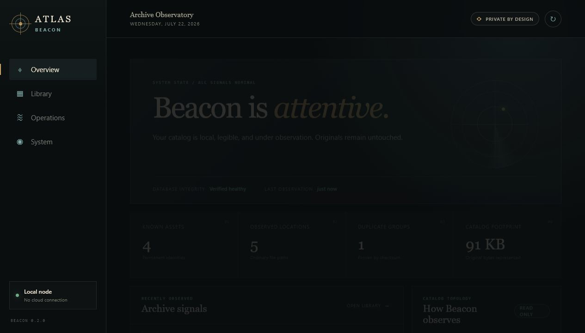

# ATLAS

ATLAS is a local-first creative archive. Beacon is its replaceable librarian: it
observes and catalogs files without owning or changing originals.

## Current application

Beacon 0.2.0 includes:

- the verified Phase 1 read-only catalog;
- a localhost FastAPI service;
- a branded archive dashboard;
- catalog search and master-detail asset inspection;
- a visible audit-event ledger;
- SQLite integrity and foreign-key health reporting;
- verified local database backups with SHA-256;
- a self-contained Windows application bundle.

No cloud service, watcher against `J:\`, or Windows service is enabled. The API
binds only to `127.0.0.1`.



## Run the Windows app

1. Open `C:\Development\ATLAS\dist\ATLAS Beacon\`.
2. Double-click `ATLAS Beacon.exe`.
3. Keep the console window open while using Beacon.
4. Close the console window or press `Ctrl+C` to stop Beacon.

The app opens `http://127.0.0.1:8765` in the default browser. Keep the entire
`ATLAS Beacon` folder together; the executable uses its `_internal` directory.

A ready-to-extract package is generated at:

```text
C:\Development\ATLAS\dist\ATLAS-Beacon-0.2.0-win64.zip
```

This private development build is not code-signed, so Windows may identify the
publisher as unknown.

## Developer workflow

```powershell
cd C:\Development\ATLAS
.\.venv\Scripts\python.exe -m unittest discover -s tests -v
.\.venv\Scripts\python.exe -m beacon.app
```

Build the Windows bundle with:

```powershell
powershell.exe -NoProfile -ExecutionPolicy Bypass -File .\scripts\build_app.ps1
```

Use only generated test files until a production scope is explicitly approved.

Verification evidence:

- [`docs/PHASE1_VERIFICATION.md`](docs/PHASE1_VERIFICATION.md)
- [`docs/PHASE2_VERIFICATION.md`](docs/PHASE2_VERIFICATION.md)
