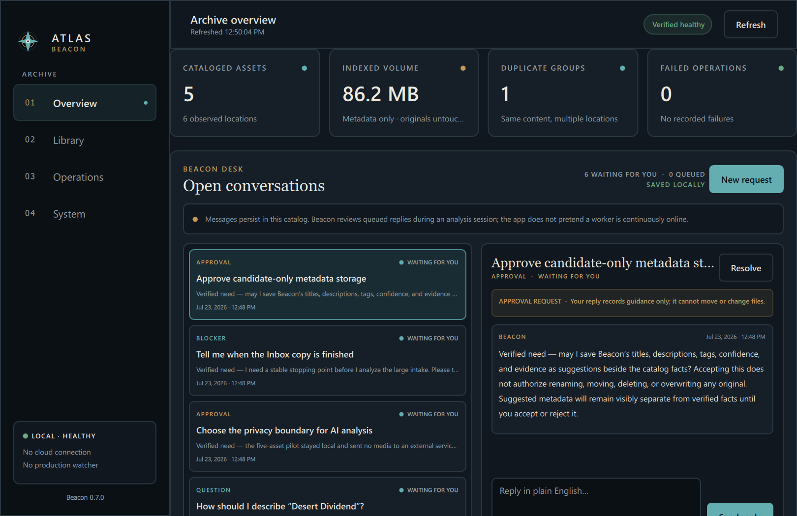

# ATLAS

ATLAS is a local-first creative archive. Beacon is its replaceable librarian: it
observes and catalogs files without owning or changing originals.

## Current application

Beacon 0.22.4 is the current packaged and live desktop release. It includes:

- the verified Phase 1 read-only catalog;
- a branded Qt Quick desktop shell with no embedded browser;
- catalog search and master-detail asset inspection;
- independently scrollable Library panels, Recents and catalog-backed Explorer
  tabs, file-type filters, and cataloged/analyzed status rails;
- verified image, video, and audio thumbnails stored as separate derivatives;
- local CR2, CR3, and common camera-RAW preview derivatives without changing
  originals;
- visual-evidence gating that refuses contextual RAW analysis when a verified
  local preview cannot be generated;
- a Finder-style Space preview for images, audio, video, and bounded read-only
  plain-text inspection, with a safe metadata fallback for binary formats;
- a persistent application-level Space shortcut and a larger selected-asset
  thumbnail in the detail header;
- checksum-bound Beacon analysis candidates with explicit confidence,
  provenance, privacy flags, and execution location;
- staged local music intelligence with BPM, key, chord-path, MIDI-note, and
  GPU-separated-stem derivatives for confidently musical audio;
- catalog search across candidate titles, descriptions, and tags without
  merging AI output into verified technical facts;
- a local-only **Analyze catalog** dialog with durable schema-13 jobs, explicit
  runtime/model readiness, and no silent cloud fallback;
- a truthful durable pipeline-stage line for active catalog analysis, including
  the display-safe current filename;
- a durable **Beacon Desk** on Overview for questions, approval requests,
  blockers, clarifications, plain-English replies, and new human requests;
- a compact shell-level Beacon conversation dock that keeps its active thread
  and draft while the user navigates, with explicit page/asset context attach;
- a loopback-only conversational worker with durable thread leases, automatic
  analysis pause, bounded read-only catalog search, and grounded result cards;
- durable recursive **Archive Intake** jobs on Overview with explicit
  snapshots, live progress, cancel-between-files, resume, retry, and
  interrupted-session recovery;
- native multi-file selection for exact human-curated Inbox batches plus a
  recursive folder picker for scoped subfolder intake;
- shared **Granular / General / Total** controls across Intake and Analysis,
  with Total as the default uncapped click-time snapshot;
- General Analysis scopes for visual, audio-only, camera RAW, or other bounded
  content, plus Granular Analysis of the current catalog asset;
- recoverable automatic disposal of Finder `.DS_Store` metadata through the
  Windows Recycle Bin before intake snapshots are frozen;
- deterministic snapshot membership: later arrivals never silently enter an
  already-created Total job;
- analysis-complete placement for files whose existing Inbox hierarchy gives
  Beacon an unambiguous final home;
- revisioned editable titles, descriptions, categories, tags, people, dates,
  places, client/project context, rights, notes, and organization directories;
- checksum-verified managed moves bounded to approved ATLAS roots, with
  non-overwrite behavior, rollback attempts, location updates, and audit events;
- zero-byte contextual-analysis exclusion without a model call;
- per-destination placement blockers that cannot stop publication or metadata
  finalization for the rest of an analysis run;
- destination-directory preflight before expensive source checksum reads and
  immediate recovery of interrupted planned moves;
- an explicit **LIVE CATALOG** label and automatic refresh when another Beacon
  process updates that catalog;
- a visible audit-event ledger;
- SQLite integrity and foreign-key health reporting;
- non-blocking verified local database backups with SHA-256;
- a windowed, icon-branded Windows application bundle;
- an optional localhost FastAPI adapter for integrations and development.

Development-environment names are deliberately separate from the product:
**Ultron** is Codex on the Windows ATLAS workstation, **Jarvis** is Codex on
Connor's MacBook, and **Beacon** remains the ATLAS application and future
persistent librarian agent.

No cloud service, continuous watcher against `J:\`, or Windows service is
enabled. Continuous open operation is a separate planned lifecycle mode; the
API is not started by the desktop application.



## Run the Windows app

1. Open `C:\Development\ATLAS\dist\releases\0.22.4\ATLAS Beacon\`.
2. Double-click `ATLAS Beacon.exe`.
3. Open Library, select an asset, and press Space (or click Preview).
4. Press Space or Escape to close the temporary preview.
5. Close the window to stop Beacon.

The app does not open a browser or listen on a network port. Keep the entire
`ATLAS Beacon` folder together; the executable uses its `_internal` directory.

A ready-to-extract package is generated at:

```text
C:\Development\ATLAS\dist\ATLAS-Beacon-0.22.4-win64.zip
```

This private development build is not code-signed, so Windows may identify the
publisher as unknown.

## Developer workflow

```powershell
cd C:\Development\ATLAS
.\.venv\Scripts\python.exe -m unittest discover -s tests -v
.\.venv\Scripts\python.exe -m beacon.desktop
```

Run the optional loopback API separately with
`.\.venv\Scripts\python.exe -m beacon.app`. Add `--browser` only when the
legacy development dashboard is specifically useful.

Build the Windows bundle with:

```powershell
powershell.exe -NoProfile -ExecutionPolicy Bypass -File .\scripts\build_app.ps1
```

Use only generated test files until a production scope is explicitly approved.

Verification evidence:

- [`docs/PHASE1_VERIFICATION.md`](docs/PHASE1_VERIFICATION.md)
- [`docs/PHASE2_VERIFICATION.md`](docs/PHASE2_VERIFICATION.md)
- [`docs/DESKTOP_VERIFICATION.md`](docs/DESKTOP_VERIFICATION.md)
- [`docs/USE_TEST_01.md`](docs/USE_TEST_01.md)
- [`docs/AI_ANALYSIS_PILOT.md`](docs/AI_ANALYSIS_PILOT.md)
