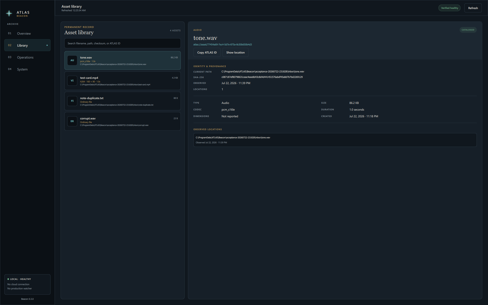

# ATLAS

ATLAS is a local-first creative archive. Beacon is its replaceable librarian: it
observes and catalogs files without owning or changing originals.

## Current application

Beacon 0.4.0 is a native Windows desktop application. It includes:

- the verified Phase 1 read-only catalog;
- a branded Qt Quick desktop shell with no embedded browser;
- catalog search and master-detail asset inspection;
- verified image, video, and audio thumbnails stored as separate derivatives;
- a Finder-style Space preview for images, audio, video, and safe metadata
  fallback for other files;
- a visible audit-event ledger;
- SQLite integrity and foreign-key health reporting;
- non-blocking verified local database backups with SHA-256;
- a windowed, icon-branded Windows application bundle;
- an optional localhost FastAPI adapter for integrations and development.

No cloud service, watcher against `J:\`, or Windows service is enabled. The API
is not started by the desktop application.



## Run the Windows app

1. Open `C:\Development\ATLAS\dist\releases\0.4.0\ATLAS Beacon\`.
2. Double-click `ATLAS Beacon.exe`.
3. Open Library, select an asset, and press Space (or click Preview).
4. Press Space or Escape to close the temporary preview.
5. Close the window to stop Beacon.

The app does not open a browser or listen on a network port. Keep the entire
`ATLAS Beacon` folder together; the executable uses its `_internal` directory.

A ready-to-extract package is generated at:

```text
C:\Development\ATLAS\dist\ATLAS-Beacon-0.4.0-win64.zip
```

This private development build is not code-signed, so Windows may identify the
publisher as unknown.

## Developer workflow

```powershell
cd C:\Development\ATLAS
.\.venv\Scripts\python.exe -m unittest discover -s tests -v
.\.venv\Scripts\python.exe -m beacon.desktop
```

Run the optional loopback API separately with
`.\.venv\Scripts\python.exe -m beacon.app`. Add `--browser` only when the
legacy development dashboard is specifically useful.

Build the Windows bundle with:

```powershell
powershell.exe -NoProfile -ExecutionPolicy Bypass -File .\scripts\build_app.ps1
```

Use only generated test files until a production scope is explicitly approved.

Verification evidence:

- [`docs/PHASE1_VERIFICATION.md`](docs/PHASE1_VERIFICATION.md)
- [`docs/PHASE2_VERIFICATION.md`](docs/PHASE2_VERIFICATION.md)
- [`docs/DESKTOP_VERIFICATION.md`](docs/DESKTOP_VERIFICATION.md)
- [`docs/USE_TEST_01.md`](docs/USE_TEST_01.md)
